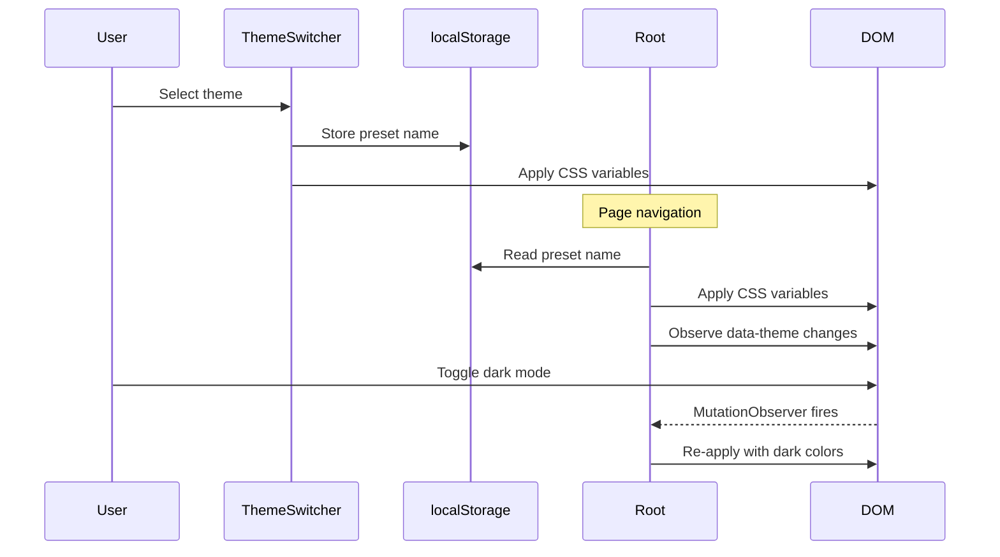

# Theme System Design

## Technical Architecture

### Component Hierarchy

```
Root.tsx (Provider)
├── ThemeSwitcher (Navbar Item)
│   └── ThemePresets (Data)
└── Application
    └── CSS Variables Applied
```

### Data Flow



### Theme Preset Interface

```typescript
export interface ThemePreset {
  name: string;           // Display name
  emoji: string;          // Visual indicator
  primaryColor: string;   // Light mode primary
  primaryColorDark: string; // Dark mode primary
  accentColor: string;    // Light mode accent
  accentColorDark: string; // Dark mode accent
}

export type ThemePresetName = 
  | 'default' | 'slack' | 'teams' | 'discord' 
  | 'whatsapp' | 'telegram' | 'imessage' 
  | 'zendesk' | 'intercom' | 'ocean' 
  | 'sunset' | 'forest' | 'rose';
```

### CSS Variable Mapping

| CSS Variable | Source | Calculation |
|-------------|--------|-------------|
| `--ifm-color-primary` | `primaryColor` or `primaryColorDark` | Direct |
| `--ifm-color-primary-dark` | Base color | -10% brightness |
| `--ifm-color-primary-darker` | Base color | -15% brightness |
| `--ifm-color-primary-darkest` | Base color | -25% brightness |
| `--ifm-color-primary-light` | Base color | +10% brightness |
| `--ifm-color-primary-lighter` | Base color | +20% brightness |
| `--ifm-color-primary-lightest` | Base color | +30% brightness |
| `--accent-color` | `accentColor` or `accentColorDark` | Direct |
| `--docusaurus-highlighted-code-line-bg` | Base color | RGBA with 10-20% alpha |

### Storage Schema

```
localStorage['docusaurus.theme.preset'] = 'slack' | 'teams' | ...
```

### Color Calculation Algorithm

The brightness adjustment uses RGB channel arithmetic:

```typescript
function adjustColor(hex: string, percent: number): string {
  // Parse hex to RGB
  const num = parseInt(hex.replace('#', ''), 16);
  const amt = Math.round(2.55 * percent);
  
  // Adjust each channel
  const R = Math.min(255, Math.max(0, (num >> 16) + amt));
  const G = Math.min(255, Math.max(0, ((num >> 8) & 0x00FF) + amt));
  const B = Math.min(255, Math.max(0, (num & 0x0000FF) + amt));
  
  // Return hex
  return `#${(0x1000000 + R * 0x10000 + G * 0x100 + B).toString(16).slice(1)}`;
}
```

### MutationObserver Configuration

```typescript
observer.observe(document.documentElement, {
  attributes: true,
  attributeFilter: ['data-theme'],
});
```

## Trade-offs

### Chosen: CSS Variables + JS Injection
**Pros:**
- Real-time updates without re-render
- Works with Infima framework
- Simple implementation

**Cons:**
- Limited to color changes
- Requires JS for theme application

### Alternative Considered: CSS Class Switching
**Pros:**
- Pure CSS solution
- No JS required after load

**Cons:**
- Large CSS bundle (13 themes × many variables)
- No dynamic color calculation

### Alternative Considered: CSS-in-JS (Emotion/Styled)
**Pros:**
- Dynamic styling with full JS access

**Cons:**
- Bundle size overhead
- Conflicts with Docusaurus theming
- Increased complexity
